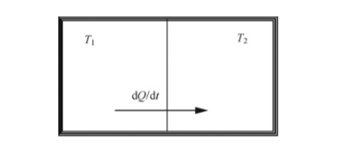

Often, when we analyze complex systems, such as cells, tissues, collodial systems, bacteria colonies, etc., the major problem is that almost all of our methods are based on the idea that all the information that is needed understand the system can be extracted from the states of the smallest units of the system. For example, if we have a collodial particles exhibiting complex behaviours, by just tracking each individiual particles, one can learn all the things that can be learnt about the system. In other words, the 6N variables cover the whole phase space.

However, let's look at very basic example; see the following figure.

	        

            
		

Now, let's define our system as all of the box containing both compartments; this is where we analyze "the whole". We know from thermodynamics that because of the temperature difference between the compartments hot and cold, there will be temperature gradient between at the boundary seperating A from B. Moreover, one can easily calculate that the entropy of the whole system will be increased by (1/T_1 - 1/T_2)\Delta Q by the time it reaches to the equilibrium. Therefore, the system goes under an irreversible process, and the evolution of the system is not time symmetric.

Now, let's "zoom in" and analyze only the hot compartment, i.e "the parts". As far as the hot compartment concerns, it is giving up heat to the environment, losing energy and entropy. Most importantly, everything is reversible from the compartment's perspective. The same can be said about the cold compartment, there is nothing irreversible about its evolution.

This suggests that having all the information about the state of each individual subunits does not contain all the information about the whole system. Because, when we analyze the compartments separately, one implicitly assumes that the sum of separated systems is the same as the combined whole systems, but this is not true unless the compartments are identical; read more about from Prigogine, Modern Thermodynamics, p116, Box 3.3.

As as result, unless the entropy production within the whole system that we are interested in is zero, our methods are basically useless if we do not account for every interaction between individial subunits, which is often quite diffucult to measure. That is why, we need new tools, new ways of looking into these kinds of systems where see complex behaviours.

